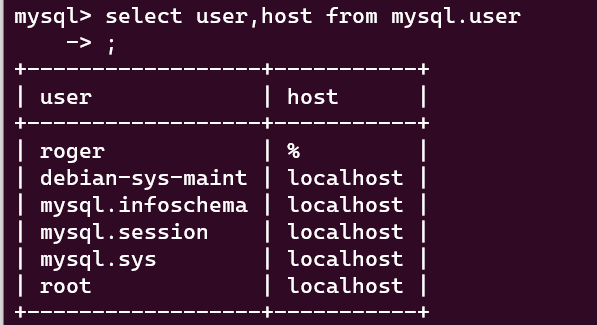

# MSSQL


## ISSUES
### Problem:  Service running in docker cannot connect to mysql in wsl2
**Solution**
Every account in mysql has a setting to allow access from certain IP address.


建立新使用者並把允許的host設成 容器的ip或是 '%' (代表允許任何網路)
Create a new user and set the allowed host to the ip of the container or '%' (allow any IP)
```sql
CREATE USER 'roger'@'%' IDENTIFIED BY 'roger';
FLUSH PRIVILEGES;
```
